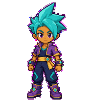
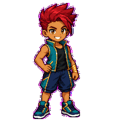
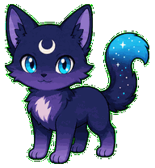

# Codex Pet Lab

[简体中文](./README.zh-CN.md)

Codex Pet Lab is an English-first, bilingual browser studio for turning a finished sprite atlas into a locally installable Codex pet package.

It validates the real atlas shape, previews every standard animation state, checks transparent unused cells, edits `pet.json`, and exports the two files Codex expects. All image processing stays in the browser.

> This repository does not bundle fake “pets” made from static portraits. Kairo, Rook, and Nebby are completed installable v2 pets; the other built-in characters remain original planning concepts until their full animation atlases pass validation.

## Ready-to-install pets

| Kairo | Rook | Nebby |
| --- | --- | --- |
|  |  |  |
| Cosmic energy fighter · 73 frames | Red-haired court ace · 73 frames | Quiet cosmic cat · 73 frames |
| [Download ZIP](https://github.com/CosmicCoderDev/codex-pet-lab/releases/download/v0.5.0/codex-pet-kairo-v2.zip) | [Download ZIP](https://github.com/CosmicCoderDev/codex-pet-lab/releases/download/v0.5.0/codex-pet-rook-v2.zip) | [Download ZIP](https://github.com/CosmicCoderDev/codex-pet-lab/releases/download/v0.5.0/codex-pet-nebby-v2.zip) |

[Open the live studio](https://cosmiccoderdev.github.io/codex-pet-lab/) · [Download v0.5.0](https://github.com/CosmicCoderDev/codex-pet-lab/releases/tag/v0.5.0)

## What it does

- English and Simplified Chinese UI, with English as the default
- Fourteen original anime, sports, fantasy, sci-fi, and mascot identity directions
- Bundled Kairo, Rook, and Nebby v2 packages, each with 73 animated frames: nine standard states plus 16 look directions
- Category filters for fighters, sports, ninja, fantasy, sci-fi, and cute characters
- Private local character-pack import from a completed `pet.json + spritesheet` folder
- Imported local packs persist in this browser through IndexedDB and never enter the GitHub repository
- Drag-and-drop validation for transparent PNG/WebP atlases
- Standard v1 support: `1536×1872`, 8 columns × 9 rows
- Extended v2 support: `1536×2288`, 8 columns × 11 rows, including 16 look directions
- Accurate preview timing for all nine standard animation states
- Alpha and unused-cell checks in the browser
- `pet.json` generation with `spriteVersionNumber: 2` for v2 packages
- Folder export through the File System Access API, with a two-file download fallback
- Safe PowerShell install and uninstall helpers for Windows
- No frontend framework and no runtime dependency

## Run locally

Serve the project from localhost (ES modules do not run reliably from a `file://` URL):

```powershell
npm run serve
```

Then open the local URL printed by the server.

## Validate the project

```powershell
npm test
npm run check
npm run check:pets
```

## Create a package

1. Prepare a transparent Codex sprite atlas.
2. Drop it into the studio.
3. Resolve every failed contract check.
4. Enter a pet ID, display name, and description.
5. Export a folder, or download `pet.json` and `spritesheet.webp` separately.

The final directory must look like this:

```text
your-pet/
├── pet.json
└── spritesheet.webp
```

## Install on Windows

From the repository root:

```powershell
.\scripts\install-pet.ps1 -SourceDir "C:\path\to\your-pet"
```

List and install either bundled pet directly from this repository:

```powershell
.\scripts\list-pets.ps1
.\scripts\install-pet.ps1 -PetId kairo -Force
.\scripts\install-pet.ps1 -PetId rook -Force
.\scripts\install-pet.ps1 -PetId nebby -Force
```

Alternatively, download a ZIP from the [v0.5.0 release](https://github.com/CosmicCoderDev/codex-pet-lab/releases/tag/v0.5.0), extract it, and pass the extracted folder through `-SourceDir`.

To replace an installed pet, add `-Force`. Then open **Settings > Pets** in Codex, select **Refresh**, and choose the pet.

To remove it:

```powershell
.\scripts\uninstall-pet.ps1 -PetId "your-pet"
```

## Atlas contract

Each cell is `192×208` pixels in an eight-column atlas. Standard rows are:

| Row | State | Used frames |
| ---: | --- | ---: |
| 0 | idle | 6 |
| 1 | running-right | 8 |
| 2 | running-left | 8 |
| 3 | waving | 4 |
| 4 | jumping | 5 |
| 5 | failed | 8 |
| 6 | waiting | 6 |
| 7 | running / active work | 6 |
| 8 | review | 6 |

V2 adds rows 9–10 for 16 clockwise look directions. Unused cells in standard rows must be fully transparent. Read [the format guide](./docs/FORMAT.md) for the complete order and timing table.

The current public ChatGPT documentation also describes custom pet creation and upload requirements in [Pets](https://learn.chatgpt.com/docs/pets.md).

## Scope and safety

- Concepts and source artwork in this repository are original.
- Do not publish celebrity likenesses, copyrighted characters, or third-party artwork without permission.
- Copyrighted character packs may be imported locally only when you have the necessary rights or your use is otherwise permitted; the project does not redistribute them.
- Passing structural validation does not replace visual QA. Always review identity consistency, motion, direction, clipping, and effects before sharing a pet.
- This is a community project and is not an official OpenAI product.

Read the full [asset policy](./ASSET_POLICY.md), [asset provenance](./docs/ASSET_PROVENANCE.md), and [contribution guide](./CONTRIBUTING.md) before publishing a pet.

## License

MIT
