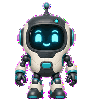
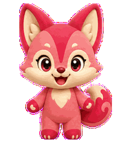

# Codex Pet Lab

[English](./README.md)

Codex Pet Lab 是一个英文优先、支持中英文切换的浏览器宠物工作室，用于把已经完成的精灵图集制作成可在本机安装的 Codex 宠物包。

它会校验真实图集尺寸、预览全部标准动画状态、检查未使用格子的透明度、编辑 `pet.json`，并导出 Codex 需要的两个文件。所有图像处理都在浏览器本地完成。

> 本仓库不会把普通静态头像冒充成可安装宠物。Kairo、Rook、Nebby、Byte 和 Momo 都是已经完成的可安装 v2 宠物；其余内置角色仍是原创形象构思，完成全部动画并通过校验后才会变成成品。

## 可直接安装的宠物

| Kairo | Rook | Nebby | Byte | Momo |
| --- | --- | --- | --- | --- |
|  |  |  |  |  |
| 宇宙能量战士 · 73 帧 | 红发球场王牌 · 73 帧 | 安静宇宙猫 · 73 帧 | 好奇代码机器人 · 73 帧 | 活泼糖果狐 · 73 帧 |
| [下载 ZIP](https://github.com/CosmicCoderDev/codex-pet-lab/releases/download/v0.7.0/codex-pet-kairo-v2.zip) | [下载 ZIP](https://github.com/CosmicCoderDev/codex-pet-lab/releases/download/v0.7.0/codex-pet-rook-v2.zip) | [下载 ZIP](https://github.com/CosmicCoderDev/codex-pet-lab/releases/download/v0.7.0/codex-pet-nebby-v2.zip) | [下载 ZIP](https://github.com/CosmicCoderDev/codex-pet-lab/releases/download/v0.7.0/codex-pet-byte-v2.zip) | [下载 ZIP](https://github.com/CosmicCoderDev/codex-pet-lab/releases/download/v0.7.0/codex-pet-momo-v2.zip) |

[打开在线工作室](https://cosmiccoderdev.github.io/codex-pet-lab/) · [下载 v0.7.0](https://github.com/CosmicCoderDev/codex-pet-lab/releases/tag/v0.7.0)

## 功能

- 完整英文和简体中文界面，默认语言为英文
- 十四个原创动漫、运动、奇幻、科幻和吉祥物形象方向
- 内置 Kairo、Rook、Nebby、Byte 与 Momo 五套 v2 成品包：每套 73 帧动画、9 种标准状态和 16 个环顾方向
- 支持按格斗、运动、忍者、奇幻、科幻和可爱分类筛选
- 可从完整的 `pet.json + spritesheet` 文件夹导入本地角色包
- 本地角色包通过 IndexedDB 保存在当前浏览器，不会进入 GitHub 仓库
- 拖放透明 PNG/WebP 图集并校验
- 标准 v1：`1536×1872`，8 列 × 9 行
- 扩展 v2：`1536×2288`，8 列 × 11 行，包含 16 个环顾方向
- 按真实帧时长预览 9 种标准动画状态
- 在浏览器内检查透明通道和未使用格子
- 生成 `pet.json`；v2 自动写入 `spriteVersionNumber: 2`
- 支持直接导出文件夹；不支持时可分别下载两个文件
- 提供安全的 Windows PowerShell 安装和卸载脚本
- 无前端框架、无运行时依赖

## 本地运行

请通过 localhost 运行项目（ES 模块无法稳定地从 `file://` 地址运行）：

```powershell
npm run serve
```

然后打开命令行输出的本地地址。

## 项目校验

```powershell
npm test
npm run check
npm run check:pets
```

## 制作宠物包

1. 准备透明的 Codex 宠物图集。
2. 把图集拖入工作室。
3. 修正所有未通过的格式检查。
4. 填写宠物 ID、显示名称和描述。
5. 导出文件夹，或分别下载 `pet.json` 与 `spritesheet.webp`。

最终目录结构：

```text
your-pet/
├── pet.json
└── spritesheet.webp
```

## 在 Windows 安装

在仓库根目录运行：

```powershell
.\scripts\install-pet.ps1 -SourceDir "C:\path\to\your-pet"
```

可以先查看列表，再按 ID 一键安装内置宠物：

```powershell
.\scripts\list-pets.ps1
.\scripts\install-pet.ps1 -PetId kairo -Force
.\scripts\install-pet.ps1 -PetId rook -Force
.\scripts\install-pet.ps1 -PetId nebby -Force
.\scripts\install-pet.ps1 -PetId byte -Force
.\scripts\install-pet.ps1 -PetId momo -Force
```

也可以从 [v0.7.0 Release](https://github.com/CosmicCoderDev/codex-pet-lab/releases/tag/v0.7.0) 下载 ZIP，解压后通过 `-SourceDir` 安装。

如需覆盖已安装宠物，增加 `-Force`。然后在 Codex 打开“设置 > 宠物”，点击“刷新”并选择宠物。

卸载命令：

```powershell
.\scripts\uninstall-pet.ps1 -PetId "your-pet"
```

## 图集规范

每格 `192×208` 像素，固定 8 列。标准动画行为：

| 行 | 状态 | 使用帧数 |
| ---: | --- | ---: |
| 0 | 待机 | 6 |
| 1 | 向右移动 | 8 |
| 2 | 向左移动 | 8 |
| 3 | 挥手 | 4 |
| 4 | 跳跃 | 5 |
| 5 | 失败 | 8 |
| 6 | 等待用户输入 | 6 |
| 7 | 执行任务 | 6 |
| 8 | 审查 | 6 |

v2 在第 9–10 行增加 16 个顺时针环顾方向。标准动画行中没有使用的格子必须完全透明。完整顺序和帧时长见[格式说明](./docs/FORMAT.zh-CN.md)。

目前公开的 ChatGPT 文档也在 [Pets](https://learn.chatgpt.com/docs/pets.md) 中说明了自定义宠物创建和上传要求。

## 范围与素材安全

- 仓库中的角色构思和源图都是原创内容。
- 没有许可时，不要公开明星肖像、版权角色或第三方作品。
- 只有在你拥有必要权利或相关使用本身获得允许时，才应在本机导入版权角色包；本项目不会再分发这些素材。
- 结构校验通过不等于视觉验收完成；发布前仍要检查角色一致性、动画、方向、裁切和特效。
- 这是社区项目，不是 OpenAI 官方产品。

公开发布宠物前请阅读完整的[素材政策](./ASSET_POLICY.zh-CN.md)、[素材来源说明](./docs/ASSET_PROVENANCE.md)和[贡献指南](./CONTRIBUTING.zh-CN.md)。

## 许可证

MIT
